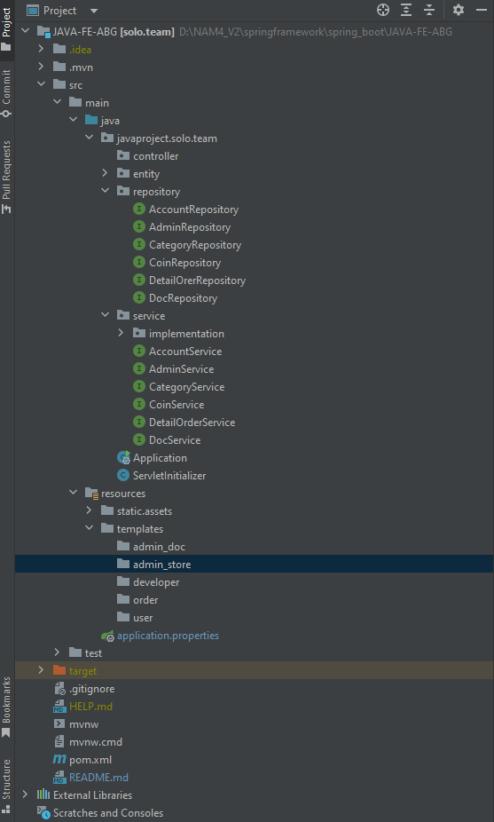

# JAVA-FE-ABG
FE-JAVA Hệ thống cổng thanh toán điện tử
## 1. Setup env
## 2. Config structure project

## 3. Config connect mysql using jpa
```
    #spring.datasource.url=jdbc:mysql://localhost:3306/abg_v1?useSSL=false&serverTimezone=UTC&useLegacyDatetimeCode=false
    #spring.datasource.username=root
    #spring.datasource.password=mysql
    
    #Hibernate
    #spring.jpa.properties.hibernate.dialect = org.hibernate.dialect.MySQLDialect
    
    #Hibernate auto ddl
    #spring.jpa.hibernate.ddl-auto=update
    
    #logging.level.org.hibernate.SQL=DEBUG

```
## 4. add controller
## 5. add view in template folder